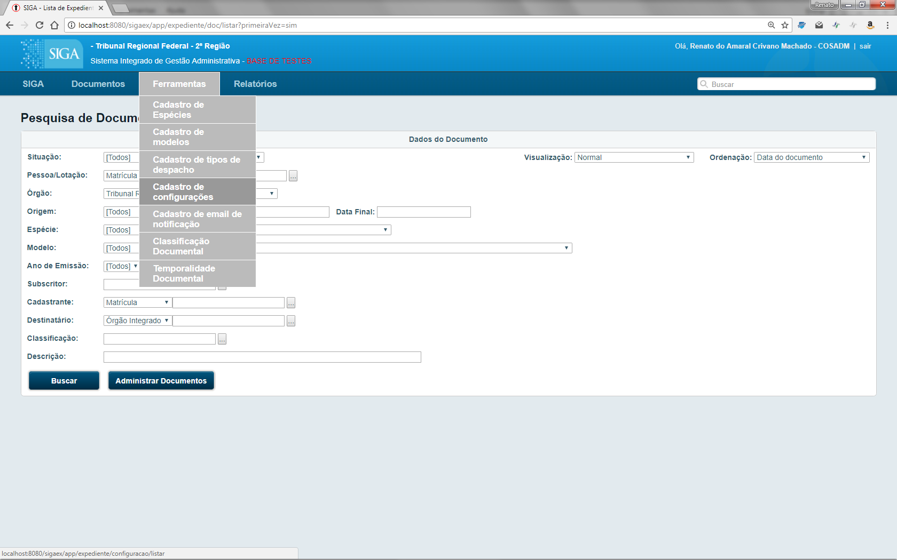
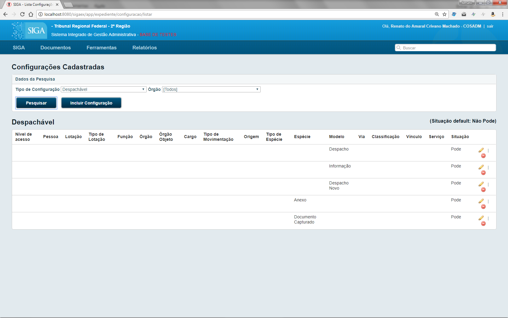
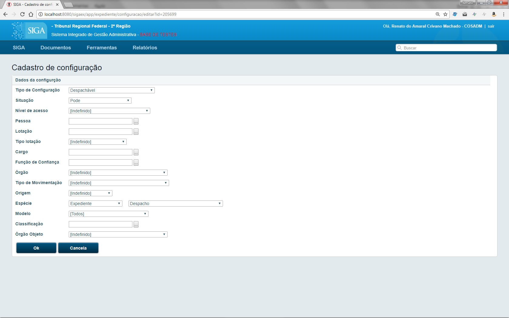

Cadastro de Configurações
=========================

Um usuário com as devidas permissões pode acessar a página de cadastro de configurações. Para isso, o usuário escolherá, no menu principal, a opção Siga > Ferramentas > Cadastro de Configurações.

A página inicial permite a pesquisa em configurações e possui links para editar ou remover uma configuração, além de um botão para criar uma nova configuração.

A página de edição/criação de configuração possui diversos campos que devem ser preenchidos de modo a especificar qual é o tipo da configuração, a quem a configuração se refere, e a que espécie/modelo ela está relacionada.

As configurações alteram o comportamento normal do sistema em diversas áreas diferentes.

O Siga sempre vai aplicar a configuração mais específica para determinada situação. Por exemplo, se houver uma 
configuração dizendo que todas as pessoas de uma lotação tem permissão para realizar determinada operação,
por outro lado houver uma configuração dizendo que determinada pessoa não tem essa permissão, será escolhida
a configuração específica da pessoa e a permissão não será concedida. O mesmo se aplica no caso de configurações
para espécies ou para modelos específicos, as configurações de modelos prevalecem. Também é possível criar configurações
gerais, sem que seja especificada pessoa, lotação, modelo ou espécie. Estas últimas serão utilizadas sempre que
não for encontrada uma configuração mais específica.

A lista completa de configurações e detalhes de como cada uma delas funciona podem ser vistos a seguir.

Configurações do Módulo de Gestão de Documentos
===============================================

Acessar
-------

Esta é uma configuração bastante delicada. A função dela é permitir que determinadas pessoas tenham acesso 
a documentos sigilosos mesmo sem estarem na lista de permissões.

O ideal é que essa configuração nunca seja 
utilizada. Melhor ainda seria apagar esse registro da tabela CP_TIPO_CONFIGURACAO para garantir que não 
será acidentalmente atribuída a ninguém.

Atender Pedido de Publicação  
----------------------------

Indica se é possível utilizar a rotina de atendimento de pedidos indiretos de publicação no Diário Eletrônico. Esta
configuração deve ser aplicada apenas aos gestores do diário.

Autuável  
--------

Indica se determinado modelo ou espécie pode ser alvo te autação. Por exemplo, se queremos autuar um memorando, qual
a lista de modelos que deve ser apresentada para o usuário escolher. Normalmente, os modelos e espécies configurados
devem ser aqueles de Processos Administrativos.

Cadastrar Qualquer Subst  
------------------------

Utilizada para configurar quais são as pessoas que tem permissão de cadastrar qualquer substituição. Nomalmente, a regra
de negócio diz que uma pessoa só pode cadastrar substitutos para si mesma ou para sua lotação, ou outras regras envolvendo
hierarquias. No entanto, uma pessoa indicada para "Cadastrar Qualquer Substituição" poderá cadastrar em nome de outras. 
Esta configuração normalmente é atribuída aos administradores do sistema ou a equipe de suporte.

Cancelar Movimentação  
---------------------

Por padão as movimentações não podem ser canceladas. Utilizando essa configuração, é possível habilitar o
cancelamento de movimentações de determinado tipo, dependendo ainda de regras de negócios específicas. Por exemplo,
para que seja possível excluir "Arquivos Auxiliares" é necessário criar uma configuração habilitando o cancelamento
de "Anexação de Arquivo Auxiliar".

Cancelar Via  
------------

Indica situações nas quais uma via pode ser cancelada.

Criar  
-----

Normalmente todos os modelos de documentos podem ser criados por qualquer usuário, mas restrições podem ser impostas
através dessa configuração. Modelos ou espécies específicas podem ser restritas de modo que apenas algumas pessoas
ou lotações tenham permissão para criá-las.

Criar Via  
---------

Utilize essa configuração para desabilitar o botão "Criar Via" em alguns ou todos os modelos de expedientes.

Definir Publicadores  
--------------------

Serve para dar permissão de utilizar rotina para redefinição de permissões de publicação no Diário Eletrônico. Esta
configuração deve ser aplicada apenas aos gestores do diário.

Definição Automática de Perfil
------------------------------

Esta configuração permite que sejam definidos perfis automaticamente quando um documento é criado para determinado 
subscritor. Normalmente ela é utilizada para que seja atribuído o perfil de revisor para documentos que serão assinados
por presidentes e diretores. Veja maiores explicações na configuração "Pode Assinar Sem Solicitação".

Para realizar a configuração, informe a matrícula do diretor em "Pessoa" e a matrícula do revisor em "Pessoa Objeto". 
Além disso, escolha no "Perfil" a opção "Revisor".

Esta configuração costuma ser utilizada juntamente com a configuração de "Pode Assinar sem Solicitação"

Destinatário
------------

Indica se determinada espécie ou modelo requerem a especificação de um destinatário, ou não. Para fazer com que o
destinatário seja exigido, preencher o campo situação com o valor "Obrigatório".

Duplicar  
--------

Configura quem e quais modelos podem ser duplicados. Por padrão, qualquer documento poderá ser duplicado por 
qualquer pessoa.

Editar  
------

Desabilita a edição de determinados modelos de documentos por determinadas pessoas. Por padrão, a edição é sempre
permitida, exceto quando viola regras de negócio.

Editar Data  
-----------

Define se a data do documento será editável ou se ela será gerada automaticamente 
pelo sistema em função da data em que o documento foi finalizado ou assinado. 

O ideal é que ninguém tenha permissão de editar a data, considerando que não é boa 
prática criar documentos com datas futuras ou retroativas.

Editar Descrição  
----------------

Define se a descrição será editável ou se será gerada automaticamente pelo sistema. Caso o sistema crie a 

Eletrônico  
----------

Identifica os modelos documentos que são exclusivamente digitais, fisícos ou os que podem assumir as duas formas. Para
forçar um modelo de documento a ser digital, utilize a situação "Obrigatório".

Excluir  
-------

Indica se é possível excluir o documento. Além dessa configuração, as regras para a exclusão de documento incluem: 
não pode estar finalizado e lotação do usuário tem de ser a do cadastrante do documento.
	 
Também é utilizado para verificar se pode ser realizada a exclusão de um cossignatário.

Excluir Anexo  
-------------

Indica se é permitido excluir uma movimentação de anexação. Além dessa configuração, as regras para a exclusão de 
anexo incluem: a anexação não pode estar cancelada, o anexo não pode estar assinado, se o documento for físico, 
não pode estar finalizado, se o documento for eletrônico, não pode estar assinado, a lotação do usuário tem de ser
a lotação cadastrante da movimentação.

Atualmente não é recomendado o uso de movimentações de anexação. Em substituição, sugerimos a utilização de
documentos capturados.

Excluir Anotação  
----------------

Indica se é permitido excluir anotação.

Finalizar  
---------

Indica se é permitido finalizar um documento.

Gerenciar Publicação Boletim  
----------------------------

Indica se determinado usuário pode, utilizar rotina para redefinição de permissões de publicação do Boletim Interno.

Incluir como Filho  
------------------

Quando é utilizada a ação "Incluir Documento", essa propriedade configura quais os modelos que devem ser
apresentados na lista para que o usuário faça a seleção. Normalmente, serão permitidos apenas modelos de despachos,
pareceres, capturados, etc. Não faz sentido, por exemplo, se seja permitido "Incluir" um Processo Administrativo
num Expediente.

Incluir Documento
-----------------

Esta configuração indica se o usuário poderá executar a ação de "Incluir Documento".

Juntada Automática
------------------

Esta configuração indica se haverá a opção de "Juntar" automaticamente no momento da assinatura do documento.

Movimentar
----------

Muitas das operações realizadas pelo Siga-Doc se enquadram na categoria "Movimentação". As movimentações são ações que
são registradas em relação à determinado documento. Trâmites, juntadas, arquivamentos, e definições de perfil são exemplos
de movimentações.

Esta configuração indica se é permitido a determinado usuário ou lotação realizar certo tipo de movimentação em algum
modelo ou espécie.

Ao introduzir configurações desse tipo, é sempre necessário informar o campo "Tipo da Movimentação".

Nível de Acesso  
---------------

Utilize essa configuração para indicar o nível de acesso default de modelos ou espécies.

Nível de Acesso Máximo  
----------------------

Utilize essa configuração para indicar o nível de acesso mais restritivo de modelos ou espécies.

Por exemplo, pode ser utilizado para indicar que determinado modelo pode ir até "Limitado entre Pessoas".

Nível de Acesso Mínimo  
----------------------

Utilize essa configuração para indicar o nível de acesso menos restritivo de modelos ou espécies.

Por exemplo, pode ser utilizado para indicar que determinado modelo pode ir até "Público".

Se desejar, por exemplo, que determinado modelo seja apenas "Público" ou "Limitado entre Órgãos", configure
o nível mínimo com "Público" e o máximo com "Limitado entre Órgãos".

Notificar Por E-mail  
--------------------

Configuração utilizada para desativar o envio de notificações por e-mail que o Siga-Doc faz, por exemplo, quando um
documento é tramitado para determinada pessoa.

Normalmente a notificação é desabilitada para determinado usuário ou lotação.

Pode Assinar sem Solicitação
----------------------------

Esta configuração é utilizada para obter um efeito muito interessante no Siga-Doc. Algumas pessoas, geralmente de alto
escalão, assinam grande quantidade de documentos por dia. Diremos que uma dessas pessoas é uma "autoridade". Devido a dificuldade de validar todos esses documentos, a autoridade pode precisar identificar pessoas de confiança para
realizarem a revisão dos documentos antes que estes apareçam na lista para assinatura em lote.

Ou seja, para que o Siga produza o comportamento esperado, é necessário fazer 3 configurações simultâneas:
1. Definir automaticamente revisores para documentos que serão assinados por determinada autoridade;
2. Indicar que a autoridade não verá na lista de assinatura em lote documentos cuja assinatura não tenha sido solicitada
por um revisor;
3. Garantir que apenas os revisores de confiança da autoridade terão a permissão de "Solicitar a Assinatura".

O primeiro passo é resolvido pela configuração "Definição Automática de Perfil", descrita acima. O segundo passo é realizado através desta configuração. E, o terceiro passo pode ser resolvido com uma configuração de "Movimentar", especificando quem pode "Solicitar Assinatura" para a autoridade. Nesse caso, a autoridade será informada no campo "Pessoa" e o revisor no campo "Pessoa Objeto".

Pode criar documento filho  
--------------------------

É utilizada para indicar se é permitida a criação de subprocesso.

Pode receber documento sem assinatura
-------------------------------------

Normalmente é impedido o trâmite de documentos que não foram assinados. Utilizando essa configuração é possível indicar
que determinada lotação pode receber documentos que ainda não estão assinados.

Refazer
-------

Indica se é permitido refazer um documento. Também têm de ser satisfeitas as seguintes condições:o documento tem
de estar finalizado, o usuário tem de ser o subscritor ou o titular do documento ou ser da lotação cadastrante do 
documento, o documento não pode estar assinado, a não ser que seja dos tipos externo ou interno importado, que
são naturalmente considerados assinados. Porém, se for documento de um desses tipos, não pode haver pdf anexado.
O documento tem de possuir via não cancelada ou volume não cancelado.

Reiniciar Numeração Todo Ano  
----------------------------

Configuração utilizada para configurar modelos ou espécies que não têm sua contagem reiniciada todo ano.
	    
Trâmite Automático  
------------------

Esta configuração indica se haverá a opção de "Tramitar" automaticamente no momento da assinatura do documento. Também 
configura o trâmite automático no caso da assinatura em lote.
	    
Utilizar Extensão de Conversor HTML  
-----------------------------------

Certa feita foi acrescentada ao Siga-Doc a possibilidade de utilizar um conversor chamado PD4ML para transformar HTML em
PDF. Esta configuração servia para configurar quais os modelos que utilizariam o PD4ML. Seu uso não é mais recomendado
pois esse componente está desatualizado.
	    
Utilizar Extensão de Editor  
---------------------------

Não é mais utilizada.

Visualizar Impressão
--------------------

Não é mais utilizada.
