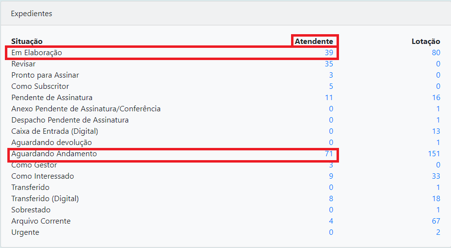
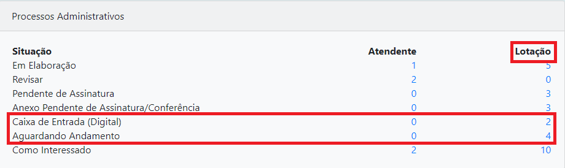

Página Inicial
==============

Após efetuar o login no sistema a página inicial será apresentada, identificando no canto superior 
direito da tela o usuário e a lotação a qual o mesmo está lotado ou substituindo.

No Siga, um usuário pode atuar como substituto de outros usuários ou lotações.

Quadro de Expedientes e Quadro de Processos Administrativos
-----------------------------------------------------------

Na página inicial serão exibidos, por situação em que se encontram, todos os documentos relacionados 
ao Atendente e a Lotação na qual esteja logado naquele momento.

**Atendente**: Esta coluna apresenta todos os documentos diretamente relacionados à matrícula do usuário 
logado no SIGA. No exemplo acima, Imagem 10 existem 6(seis) expedientes que estão sendo elaborados 
sob uma matrícula (Em Elaboração) e 2 Despachos pendentes de assinatura(Transferido), entre outros.

**Lotação**: Esta coluna apresenta todos os documentos "na carga" da lotação em que o usuário está logado, 
(inclui os documentos relacionados à matrícula e disponibilizados também na coluna Atendente, já que 
o atendente é uma das matrículas integrantes da lotação). No exemplo acima, Imagem 11 existem 1(um) 
Processo físico para ser recebido pela lotação (A Receber (Físico)) e 3 Processos (Aguardando Andamento), entre outros.

Para obter a descrição de cada uma dessas situações, posicione no Quadro de Documentos, o ponteiro do mouse sobre a 
Situação ou sobre o quantitativo do Atendente ou da Lotação.

.. image:: inicial-detalhe-descricao.png

Localizando um Documento pelo Número
------------------------------------

Caso saiba o número do documento, e se for datado com o ano atual, e criado pelo mesmo órgão de que o usuário faz parte, 
utilize o campo livre na página inicial do SIGA informando: tipo de documento + o número do mesmo, ex: mem560, ofi345... 
O sistema possui uma máscara que formatará para o modelo “TRF2-MEM-2017/00560-A”. Caso o documento não seja do mesmo 
órgão que o usuário, informe o número do documento, porém antecedido da sigla do órgão: “JFRJMEM560”, que será formatado 
para “JFRJ-MEM-2017/00560-A”. O mesmo funciona para anos anteriores, “MEM2014/560”.                                

