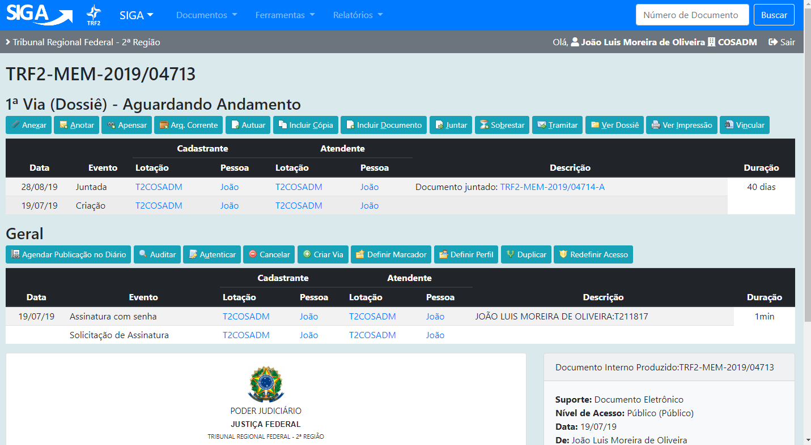
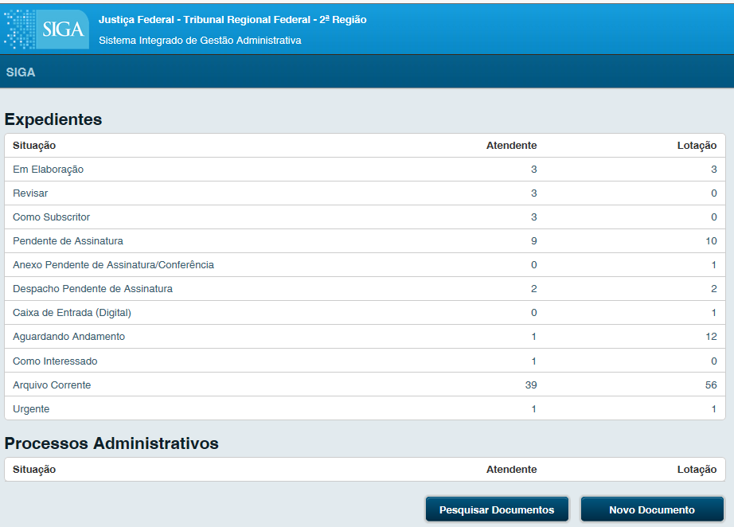
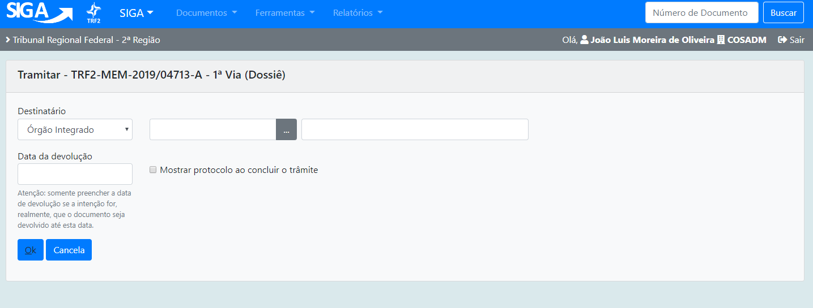
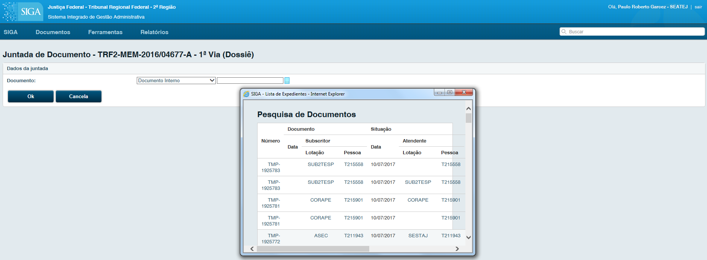
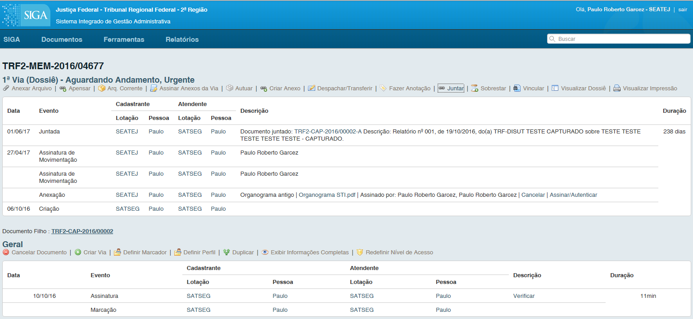
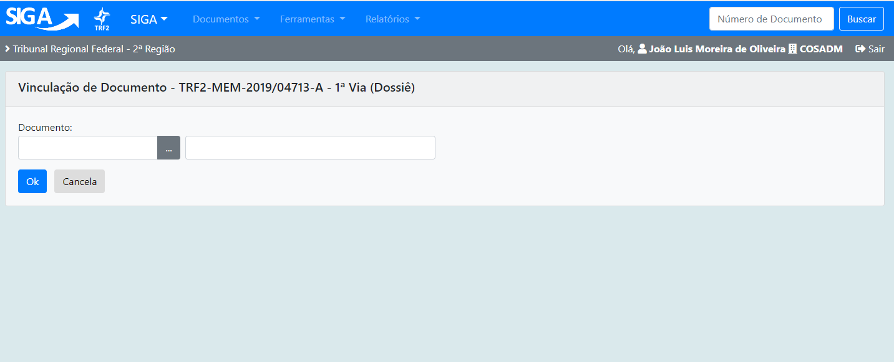

Movimentando um Documento
=========================

Guia da Via e Geral, na guia referente à Via e Geral o usuário obtém a visão geral do estado de cada um dos 
documentos e os recursos disponíveis para avaliar, complementar informações, movimentar ou arquivar o documento

Anexar Arquivo
--------------

Anexa um arquivo, sempre no formato PDF, ao documento em questão. 

Para gerar um arquivo em PDF, realize uma impressão selecionando a impressora  “CUT PDF Writer” ao selecioná-la 
o sistema solicitará um diretório para gravar o novo PDF gerado.

Arq. Corrente
-------------

(opção válida  para documentos “em andamento”); Arquiva o documento em questão, que poderá ser 
localizado no Quadro de Expedientes na página inicial.

Despachar e Transferir
----------------------

No despacho é permitido ao usuário criar outro tipo de documento, selecionando a opção “Texto Longo”. 

.. image:: mov-tramitar-2.png

O sistema carregará a tela de criação de um novo documento (imagem 14), que apresentará a opção Tipo, já preenchida como Despacho,
possibilitando ao usuário criar este novo documento.

Na imagem 25, acima, consta a visualização da opção de um despacho Outros do tipo Texto Longo para o documento TRF2-MEM-2016/04677.

Após realizar todo o procedimento normal de criação deste despacho (imagem 14) e acessar a opção Registrar Assinatura manual, conforme 
a tela de Detalhes do Documento (imagem 4), o sistema, automaticamente, "realiza uma Juntada" ao documento inicialmente despachado.

Duplicar
--------

Cria uma cópia, sempre com o status “temporário”, com todos os campos já preenchidos com os dados do documento duplicado. O documento 
Original não é modificado.

Editar
------
Volta para tela de edição do documento. Apenas Documentos temporários e documentos eletrônicos “pendentes de assinatura” poderão ser editados.

Excluir
-------

Exclui o documento em questão. Apenas documentos temporários poderão ser excluídos.

Exibir informações completas
----------------------------

Exibe todas as informações ocultas de um documento, como: Guia Geral, Outras Vias se houver, todas as Exclusões e outras Movimentações, etc.

Fazer anotação
--------------

Anexa um pequeno texto, observação, ao documento em questão. O texto será exibido ao final de uma coluna.

Finalizar
---------

Finaliza um documento temporário. Após o documento ser finalizado é gerado um número definitivo e nenhum documento físico poderá mais ser 
editado, documentos eletrônicos poderão ser editados desde que ainda não assinados. Apenas documentos temporários poderão ser finalizados.

Incluir Cossignatário
---------------------

Inclui um segundo subscritor, ou mais de um, ao documento em questão. O(s) cossignatário(s) aparecerá(ão) ao final do documento, 
junto ao subscritor principal. Apenas documentos temporários poderão ser sofrer a inclusão de cossignatários.

Juntar
------

Ao selecionar esta opção, o sistema apresentará a tela acima. Na opção Documento Interno é possível selecionar todos os documentos 
que estão com status Em andamento que são possíveis de ter um documento juntado a ele. Apenas será possível juntar documentos que 
estejam na mesma lotação. Ex.: Caso a lotação de origem do usuário logado no sistema seja Presidência, ao selecionar esta opção, serão 
apresentados todos os documentos da Presidência com o status Em Andamento, que poderão ter um documento juntado a ele.

Na imagem acima, o documento capturado TRF2-CAP-2016/00002  foi juntado ao documento T2-MEM-2016/04677, neste caso, o documento capturado 
foi incorporado ao memorando, e acompanhará todas as movimentações ocorridas no mesmo.

- A juntada ocorre também nos despachos "Textos Longos" após estes receberem o Registro de Assinatura Manual. 
- Após um documento ser juntado a outro, automaticamente este passa a ser movimentado a partir do documento ao qual foi juntado, 
  que passa a ser considerado o documento principal.
- Apenas documento "Aguardando Andamento" poderão ser juntados.

Redefinir Nível de Acesso
-------------------------

Limita o acesso do documento ao usuário/órgão/lotação desejado.

Vincular
--------

Quando é necessário fazer uma referência a outro documento dentro do SIGA, esta opção é a mais adequada. Diferente de Juntar, Vincular 
apenas disponibiliza um link para acesso a outro documento. Após serem vinculadas, todas as opções continuam ativas (Despachar/Transferir, 
Anexar, Arq. Corrente etc.). 

A Vinculação é apresentada como um link, ex: Ver Também TRF2-OFI-2017/99999

Visualizar Dossiê
-----------------

Visualiza todos os arquivos deste documento. Esta opção permite que sejam impressos todos os despachos, anexos e todos os documentos 
integrantes deste documento principal.

Visualizar Impressão
--------------------

Visualiza como realmente o documento será impresso. Nesta, há a opção de imprimir o documento. 

Enquanto o documento não for finalizado e estiver com número temporário, aparecerá uma tarja de “Rascunho” em marca d’água. Documentos 
digitais perderão a tarja de rascunho apenas quando registrada a assinatura digital.
