Novo Documento
==============

Para criar um documento, acesse a opção: “Novo Documento” na página principal.

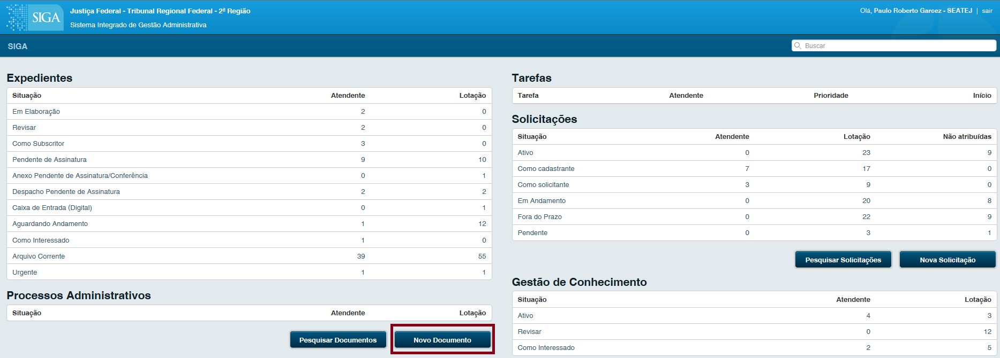

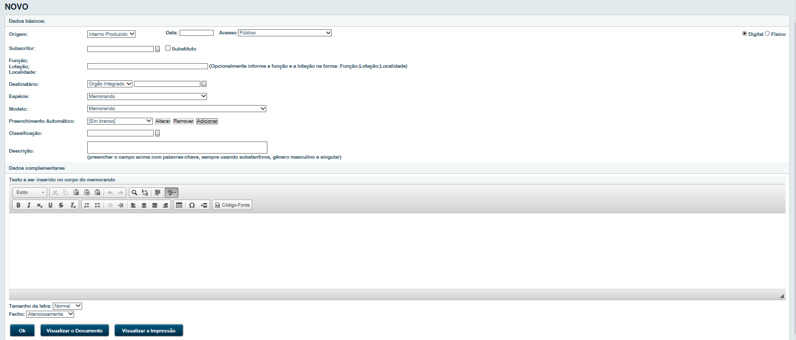

Origem
^^^^^^

Há 4 tipos de origens, que podem ser classificadas como:

#. Capturado: O objetivo desse documento é substituir o recurso Anexar Arquivo (PDF) em processos administrativos, possibilitando 
   a organização e identificação desses documentos (PDF) que são juntados aos processos. Para juntar um PDF como documento Capturado, 
   basta acessar o processo administrativo, clicar em Despachar/Transferir, escolher Despacho Longo e, em seguida, mudar a origem do 
   despacho para Capturado; A listagem dos modelos de documentos Capturados existentes no sistema está no arquivo que pode ser gerado 
   no próprio Siga-Doc, na opção Relatórios > Relação de formulários.

#. Externo: para cadastrar documentos originários de órgãos externos (AGU, Banco do Brasil, CEF, STF etc). O SIGA irá gerar uma 
   folha de rosto, citando o signatário, o número do documento e o número SIGA gerado.

#. Interno Produzido: utilizar esta opção para a criação de um documento novo no SIGA.

#. Interno Importado: para cadastrar um documento recebido fisicamente, em papel, sem origem no SIGA por um órgão integrado 
   (TRF2, SJRJ e SJES). O SIGA irá gerar uma folha de rosto, citando o signatário, o número "antigo" e o número SIGA gerado.

Quando recebemos um documento cuja origem é de algum órgão externo, devemos cadastrá-lo como Externo. Para isto, devemos seguir 
o procedimento para criação de um novo documento, porém com o campo Origem selecionado como Documento Interno ou Externo 
(imagem 15 página 8). A seguinte tela será apresenta:

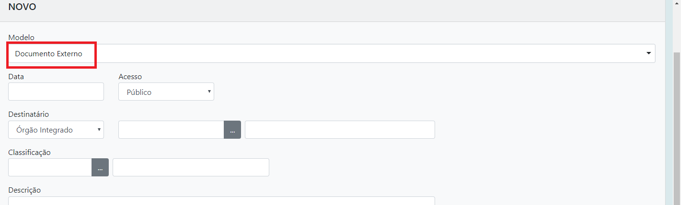

Esta opção oculta o campo Entrevista, responsável pela elaboração do texto do documento, gerando apenas uma capa de rosto contendo sua
numeração anterior e sua numeração válida dentro do SIGA, como na imagem seguinte:

.. image:: novo-documento-externo-folha-de-rosto.png

O usuário, se possível, deve digitalizar o documento recebido fisicamente e anexá-lo dentro do SIGA. Após clicar a operação “finalizar”, 
será gerada uma folha de rosto que o usuário deverá anexar ao documento para permitir que todos os usuários que manipularem o documento 
saibam que este já foi registrado.

Apesar de estas duas classificações gerarem a mesma folha de rosto, há diferença quanto ao seu preenchimento. Quando selecionada a 
opção Interno Importado no campo Origem é apresentado o campo Subscritor e Destinatário com a tela de filtro:

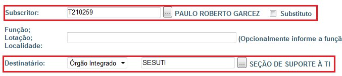

Este filtro possui os dados de todas as pessoas que estão cadastradas em órgãos integrados, diferente dos órgãos externos que não 
possuem cadastro no sistema, disponibilizando apenas um campo de texto livre:

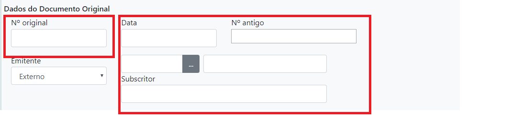

Data
^^^^

Campo não obrigatório. Poderá ser preenchido com datas retroativas. Caso não preencha este campo, será automaticamente informada 
a data atual. Apenas será exibida a data após o documento ser finalizado.

Acesso
^^^^^^

Disponibiliza critérios de acesso para definição da “CONFIDENCIALIDADE”  do documento.

* **Público**: Todos podem visualizar o conteúdo do documento. 

* **Limitado ao órgão**: Todos lotados no órgão específico (TRF2, JFRJ ou JFES) onde o documento foi criado, podem visualizá-lo.

* **Limitado de pessoa para subsecretaria**: Somente a pessoa, subscritora, e a lotação destinatária podem visualizar o documento.

* **Limitado de subsecretaria para pessoa**: Somente a lotação subscritora e a pessoa destinatária podem visualizar o documento.

* **Limitado entre lotações**: Somente as lotações, subscritora e destinatária, podem visualizar o documento.

* **Limitado entre pessoas**: Somente as pessoas, subscritora e destinatária, podem visualizar o documento.

De acordo com o selecionado, o documento apenas será recebido e lido pelo destinatário e pelo remetente, sendo um setor ou matrícula específica. 

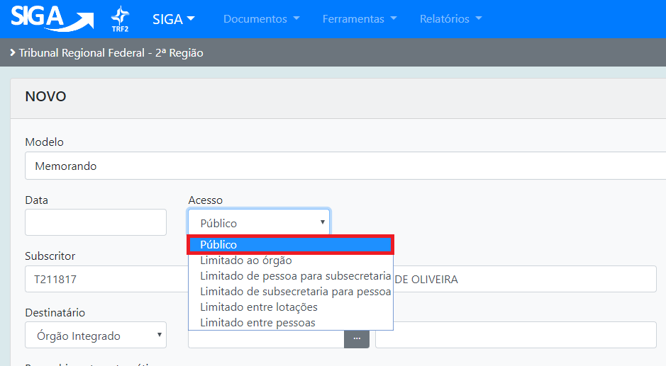

Digital / Físico
^^^^^^^^^^^^^^^^

* **Digital**: Marca o documento como digital, este documento terá a impressão opcional e receberá a assinatura digital através do certificado digital.

* **Físico**: Marca o documento como físico e a impressão obrigatória.

Subscritor
^^^^^^^^^^

Responsável pela assinatura do documento. O nome informado neste campo será impresso ao final do documento.

Substituto
^^^^^^^^^^

Quando o subscritor estiver substituindo outro, ao marcar esta opção, aparecerá um novo campo, onde poderá ser informado o subscritor
substituído e quem assina por ele.

Personalizar
^^^^^^^^^^^^

Alterar Função; Lotação; Localidade; Nome (opcional); este campo deve ser preenchido  caso se deseje exibir a função, lotação, 
localidade ou nome do subscritor de forma diferente do cadastro. Deve-se respeitar a ordem, separados por ‘;’ (ponto e vírgula), 
de forma a corrigir o texto anterior. 

Por padrão, o SIGA busca os dados cadastrados. Assim, se o campo não for preenchido, serão exibidos os dados cadastrados. 
Esta opção é utilizada, por exemplo, nos casos em que o subscritor atua também em outra função diferente da cadastrada, 
ex.: Juiz Substituto (convocado), Presidente Comissão XXXXX.

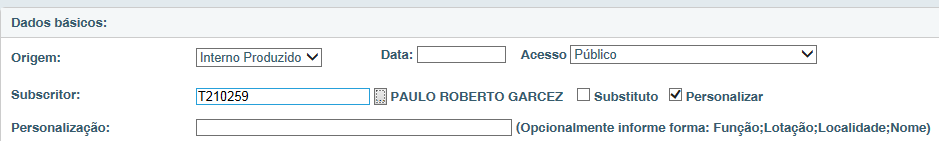

Se o Subscritor informado for exibido como “DESEMBARGADOR FEDERAL” e a sua lotação for “GABINETE DO DR.XXXXX” e não forem essas 
as suas atribuições, preencher o campo substituindo pelas atribuições desejadas. Todo texto digitado será exibido, respeitando a 
ordem Função; Lotação; Localidade; Nome, sempre separados por ‘;’ (ponto e vírgula), como em: 

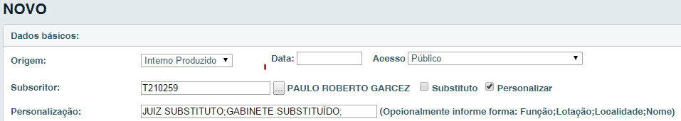

.. image:: novo-documento-personalizar-assinatura-2.png

Caso queira que uma informação não seja exibida, preencha o campo desejado com um espaço vazio, com a mesma regra de espaço:

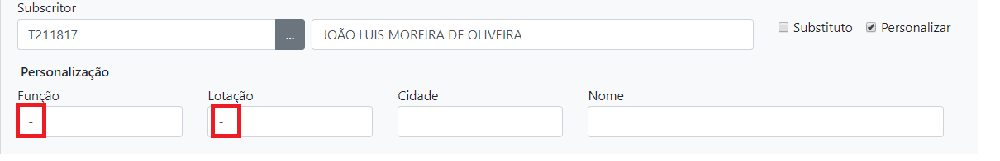

Assim, por exemplo, quando um magistrado está no exercício da titularidade da "Vara Federal X", localizada no município "Cidade Y" 
e quer que o seu nome apareça como “MagistradoN”,  pode ser digitado o seguinte valor nesse campo:

   Juiz Federal no Exercício da Titularidade;Vara Federal X;CidadeY;MagistradoN

Destinatário
^^^^^^^^^^^^

Deve ser informado o nome do órgão ou matrícula do destinatário do documento. Por default aparece Órgão Integrado, mas existem 
as opções: Matrícula, Órgão Externo e Campo Livre; 

* **Órgão Integrado**: para selecionar uma lotação do TRF2, SJRJ ou SJES;
* **Matrícula**: para selecionar uma matrícula do TRF2, SJRJ ou SJES;
* **Órgão Externo**: para selecionar um órgão cadastrado na tabela de órgãos externos;
* **Campo Livre**: para preenchimento quando o destinatário não constar de nenhuma das outras opções.

Obs.: Quando necessário pode ser solicitado o incremento de órgãos na tabela de órgãos externos.

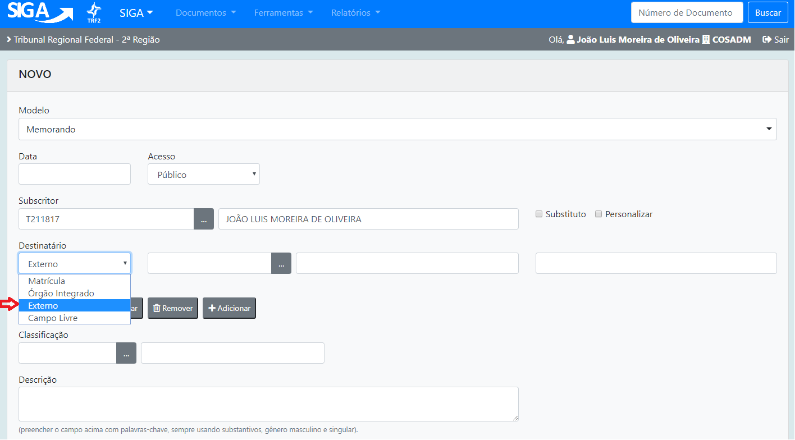

Espécie
^^^^^^^

Selecionar a espécie do documento em questão (Memorando, ofício, Despacho etc).

Modelo
^^^^^^

Selecionar modelos pré-definidos para a espécie selecionada, se houver.

Preenchimento automático
^^^^^^^^^^^^^^^^^^^^^^^^

Caso o documento seja rotineiramente utilizado o mesmo poderá ser gravado no sistema como se fosse  um modelo. 
Para utilizar esta funcionalidade, após preencher e verificar todos os campos da tela e antes de clicar no botão OK, deve-se selecionar 
a opção “Adicionar”. O sistema solicitará um nome para esse preenchimento automático e criará o modelo que ficará disponível para todos 
os usuários da mesma lotação, assim, na próxima edição em que o modelo for acionado, todos os campos do documento serão recuperados 
automaticamente, cabendo ao usuário apenas fazer os ajustes necessários para o novo documento, também estão disponíveis as opções: 
Alterar e Remover o Preenchimento automático.  

Classificação
^^^^^^^^^^^^^

Deve ser preenchido com a classificação documental. Cada classificação implica diretamente na vida útil dos 
documentos e na criação de vias. Por padrão, o sistema disponibiliza uma busca, onde o usuário poderá escolher a classificação que 
mais se enquadre com o conteúdo do documento. Ex.: Caso seja um documento que diz respeito às férias de um servidor, preencha o campo 
com a palavra “ferias”. O sistema buscara todas as classificações que se equiparam a “ferias”. Para concluir, basta selecionar o 
número do código da classificação: 

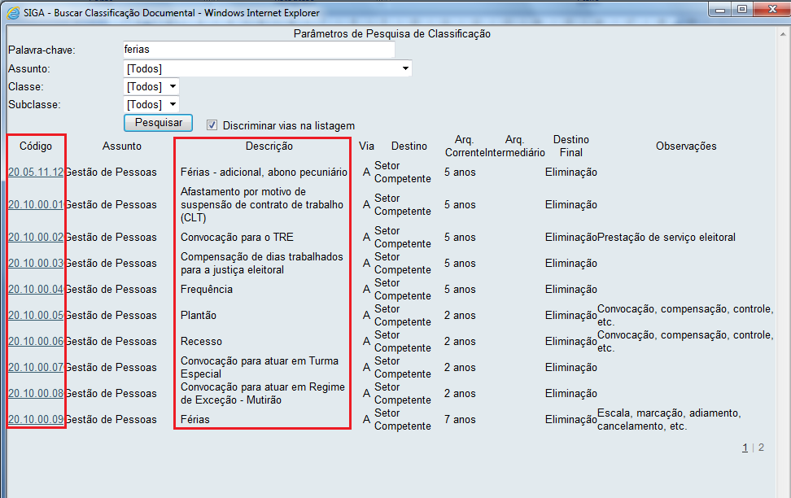

Em caso de dúvidas quanto a CLASSIFICAÇÃO, contate o setor responsável nos ramais 8135 ou 8474.

Descrição
^^^^^^^^^

(Campo obrigatório); Deve ser preenchido com o assunto principal do documento. Ex: “Férias do Servidor Fulano”; “Solicitação de Material”; “Processo de VPNI”. Esse campo serve como referência a pesquisas futuras. Sempre preencher com dados objetivos.

Entrevista
^^^^^^^^^^

É o corpo, a parte textual do documento a ser preenchida. Evite colar texto direto do Word ou outros editores mais complexos, caso o texto seja muito extenso, utilize o bloco de notas como intermediário, cole o texto no bloco de notas, em seguida cole parágrafo por parágrafo no editor do SIGA, a fim de evitar que ocorra uma possível desformatação.

Tamanho da Letra
^^^^^^^^^^^^^^^^

(Pequena; Normal; Grande); Tamanho de todo o texto. Caso o documento apresente duas páginas e, na segunda folha apresente apenas o nome do subscritor, este campo poderá ser alterado a fim de possibilitar o ajuste.

Ok, Visualizar o Modelo e Visualizar Impressão
^^^^^^^^^^^^^^^^^^^^^^^^^^^^^^^^^^^^^^^^^^^^^^

Finalize a edição do documento com a opção “OK”. Para visualizar o texto do documento acesse a segunda opção, para ver o documento gerado em PDF acesse a terceira opção.

- Após o Ok  o documento ganhará um número provisório, TMP-9999999.
- Com o documento nessa condição, TMP, o mesmo ainda poderá ser editado, Editar,  ou excluído, Excluir.

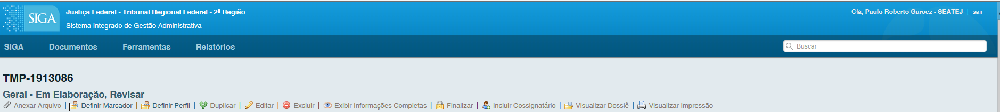

Somente quando finalizado, opção  Finalizar, é que o documento ganha número permanente composto por:

- Órgão (TRF2, SJRJ ou SJES);
- Espécie (MEM, OFI, REQ, outros);
- Ano de criação (2016, 2017...);
- Número sequencial relativo à espécie, no ano e órgão. 

Ex.: TRF2-MEM-2016/04677:

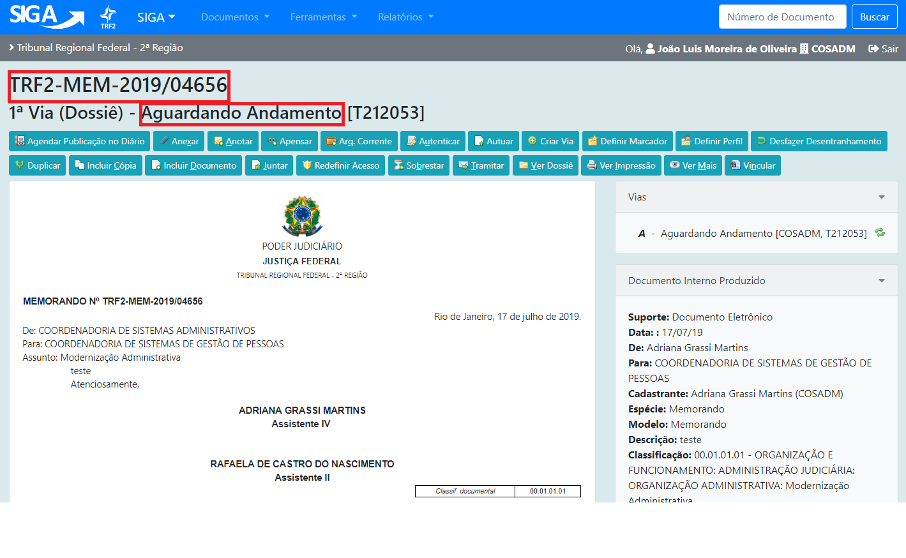
