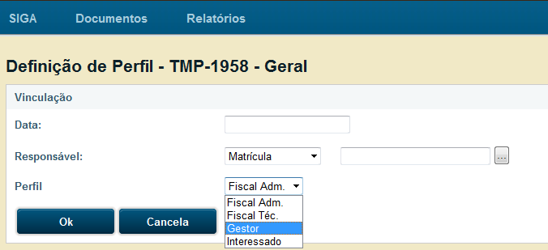

Processo Administrativo
=======================

Tipos de Processo

- Processo de Execução Orçamentária e Financeira - EOF;

- Processo de Outros Assuntos Administrativos - ADM;

- Processo de Pessoal - PES; 

Finalidade de cada tipo de processo
-----------------------------------

Processo de Execução Orçamentária e Financeira - EOF
^^^^^^^^^^^^^^^^^^^^^^^^^^^^^^^^^^^^^^^^^^^^^^^^^^^^
Para os diversos tipos de contratação, como Ata de registro de preços, Contrato de exclusividade, de prestação continuada e processos de 
execução orçamentária e financeira. A criação desse tipo de processo não está restrita à SPO. Qualquer outra U.O. pode criá-la.

Processo de Outros Assuntos Administrativos - ADM
^^^^^^^^^^^^^^^^^^^^^^^^^^^^^^^^^^^^^^^^^^^^^^^^^
Utilizado para processos cujo objeto é diferente dos objetos especificados nos outros tipos (de execução orçamentária, de pessoal, de 
sindicância etc). Aberto a todas as U.Os.

Processo de Pessoal - PES
^^^^^^^^^^^^^^^^^^^^^^^^^
Para assuntos relativos a servidores e, talvez, magistrados. A entrega anual de declaração de IR, por exemplo, gera um "PES" para cada 
servidor. Mas sua criação não está restrita a servidores da SRH.

O subscritor do processo deve ser a autoridade competente para instaurar cada um dos tipos processuais e os servidores no exercício de 
suas funções.

Subprocesso, Apenso e Volume
----------------------------

Qual a diferença entre APENSO e SUBPROCESSO?

Apenso é quando "amarramos" um documento no outro (físicos) para andarem juntos. Esses documentos podem ser dois ou mais processos ou dois ou mais volumes de um mesmo processo. Exemplos: os volumes 01 e 02 do processo T2-EOF-2011/123 estão apensados, ou os processos T2-EOF-2011/456 e T2-EOF-2011/789 estão apensados. Dessa forma, se fazemos a remessa de um deles, o outro é automaticamente remetido para o mesmo local, pois estão "amarrados" um ao outro.

O Subprocesso, Documento Filho, é um "filho" do processo principal. Se não houvesse a figura do subprocesso, todos os atos de um determinado processo administrativo, como por exemplo aditamentos, pagamentos de notas fiscais etc., aconteceriam no mesmo conjunto de documentos. Através do subprocesso é possível dividir o conjunto principal, Documento Pai, em subconjuntos com independência de movimentação.

Por exemplo: No caso de um processo do tipo EOF, cujo objeto seja a contração de serviços a serem prestados de forma continuada, enquanto no processo principal, Documento Pai, ficam os contratos e os aditamentos, no Subprocesso, Documento Filho, ficam as notas fiscais e seus pagamentos. 
Assim, caso a Administração precise, ao mesmo tempo, pagar uma nota fiscal e aditar o contrato, ela pode fazê-lo ao mesmo tempo, pois o processo principal, Documento Pai é enviado para a Seção de Contratos, para os tramites do aditamento, enquanto o subprocesso, Documento Filho, vai para a SPO, para fazer o pagamento das notas fiscais.

É importante lembrar que o Subprocesso, Documento Filho, apesar de ser parte integrante do  processo principal, Documento Pai,  é um documento “INDEPENDENTE”, e tem tramitação própria. Caso seja necessário, pode-se apensá-lo ao processo principal para caminharem juntos.

Além disso, o processo principal, Documento Pai, e Subprocesso, Documento Filho,  podem ter um ou mais volumes.

Volume é um conjunto de documentos agrupados de acordo com a capacidade física do dispositivo disponível para sua formação, no caso dos processos administrativos, sua limitação é o máximo que uma “capa de processo” pode envolver,  mantendo-se  organizada para permitir o manuseio, ou seja, tão logo um volume atinja um certo tamanho que dificulte a manipulação de seu conteúdo o mesmo deverá ser encerrado ensejando a abertura de novo volume.

Criação de Processos novos
--------------------------

Os processos novos serão criados como Interno Produzido, para isso deve-se identificar o Subscritor, selecionar o tipo do processo, preencher o campo descrição, finalizar e registrar a assinatura, essa operação criará a capa do processo na qual será juntado o documento gerador do processo, por exemplo, um requerimento, uma requisição, ou outros documentos necessários à sua formação.
Feito isto a capa gerada deverá ser impressa e colada ou grampeada à capa física a fim de iniciar a tramitação do processo no SIGA e também fisicamente.

Obs.: 
Todo documento, digital ou não, só passa a ter valor depois de assinado. Com relação aos processos administrativos, o ideal é que todos os atos sejam assinados digitalmente. Fez um despacho, assina; anexou um PDF qualquer, assina; (cada um dos arquivos) etc.

Definir Perfil
--------------

Deverá ser preenchido nos seguintes casos:

* **Interessado**: Quando recebido um requerimento e aberto um processo que possua nível de acesso restrito, o subscritor deverá cadastrar o requerente como interessado, a fim de que este possa também acompanhar o andamento do processo.

* **Gestor**: Deve ser cadastrado pelo próprio gestor, em cada processo e subprocesso em que é gerente.

* **Fiscal Adm.**: Serve para marcar os fiscais administrativo de um EOF de pagamento

* **Fiscal Téc.**: Serve para marcar os fiscais técnico de um EOF de pagamento.

