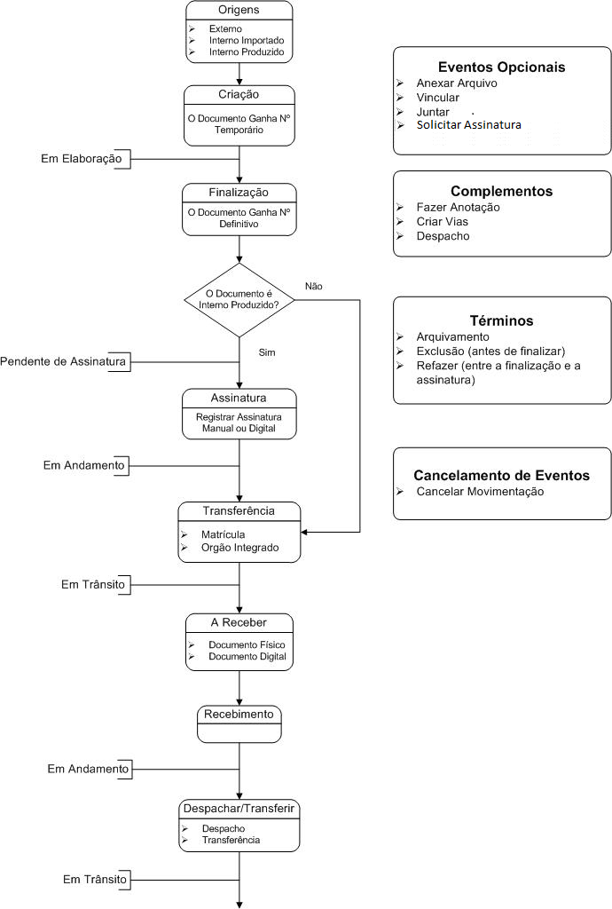

Resumo do Processo de Criação e Movimentação de Documentos
==========================================================

* Processo de criação do documento - inicialmente é gerado um número temporário TMP até que ocorra a sua finalização, sendo o mesmo 
  exibido no Quadro de Documentos com a situação Em Elaboração,  permitindo as seguintes ações: (Finalizar, Editar, Excluir,  
  Incluir Co-signatário, Anexar Arquivo, Fazer Anotação, Vincular Perfil, Redefinir Nível de Acesso, Duplicar);

* Uma vez finalizados, os documentos ganham um número definitivo e permanecem, até que sejam assinados, na situação Pendente de Assinatura; 

  Obs. O número definitivo é gerado automaticamente para cada tipo de documento, memorando(MEM), ofício(OFI), despacho(DES), sendo esta 
  numeração por tipo única para todo o TRF2, ou seja, o memorando TRF2-MEM-2017/07381 pode ser gerado pela DICRE, o TRF2-MEM-2017/07382 
  pela STI, o TRF2-MEM-2017/07383 pela SPO, etc.

* Finalizado o documento, quando é gerado o seu número definitivo, o mesmo aparece no quadro de documentos na situação Pendente de 
  Assinatura quando são possíveis as seguintes ações: (refazer, criar anexo, vincular perfil, criar via, registrar assinatura, assinar 
  digitalmente, juntar);
  
  * Caso sejam criadas vias adicionais, nestas, pode-se efetuar ainda as seguintes ações: Despachar / Transferir, Arquivar Corrente, 
    Anexar Arquivo, Fazer Anotação, Juntar, Vincular, Apensar, Visualizar Dossiê e Visualizar Impressão. 

  * A CRIAÇÃO DE VIAS SÓ É RECOMENDADA NOS CASOS EM QUE A MESMA SEJA CONSIDERADA EXTREMAMENTE NECESSÁRIA, É BOM SABER QUE CADA UMA DESTAS 
    VIAS SEGUIRÁ COMO UM DOCUMENTO TOTALMENTE INDEPENDENTE DOS DEMAIS.

* Possibilidades de ações, a qualquer tempo (Anexar Arquivo, Juntar, Redefinir Nível de Acesso, Exibir Informações Completas, 
  Visualizar Dossiê, Visualizar Impressão, Fazer Anotação, Vincular);

* Movimentação de Documentos (Despachar / Transferir, Receber, Arquivar Corrente, Excluir Movimentação, Desfazer Recebimento)

  * Os documentos físicos enquanto não recebidos encontram-se, no Quadro de Documentos, na situação:

    * A Receber (Físico) - do destinatário;
    * Transferido - do remetente.

  * Os documentos eletrônicos enquanto não recebidos encontram-se, no Quadro de Documentos, na situação: 

    * Caixa de Entrada (Digital) – do destinatário;
    * Transferido (Digital) - do remetente.

* Os documentos físicos ou eletrônicos uma vez que sofram a ação Receber, saem da situação A Receber Físico e Caixa de Entrada Digital, 
  respectivamente, passando a constar na situação Aguardando Andamento, quando são possíveis as seguintes ações: (criar anexo, arquivar, 
  despachar/transferir, fazer anotação, redefinir nível de acesso, duplicar, vincular perfil, criar via, juntar);

  * ATENÇÃO! Os documentos Em Elaboração, uma vez finalizados, passam a constar na situação Pendente de Assinatura, devendo sofrer a ação 
    adequada. (vide ações acima destacadas em azul).

