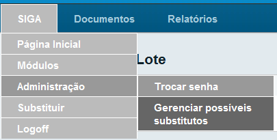
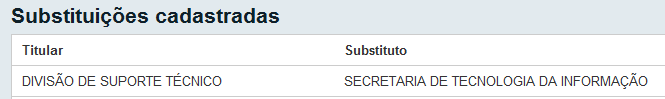
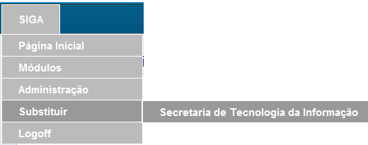
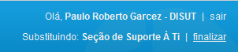

Substituição
============

O objetivo desta funcionalidade é:

* Possibilitar a todos os gerentes, na sua Unidade, a mais abrangente organização interna de divisão e distribuição de tarefas e atividades.

* Possibilitar a todas as Unidades o controle e a movimentação de seus documentos entre os setores internos.

Este procedimento demanda a atuação de um servidor lotado na unidade solicitada, pois somente um servidor lotado na unidade tem autorização 
para conceder tal substituição, preferencialmente o Chefe do Setor.

Os substitutos não tem autorização para conceder substituições.

O Diretor/Coordenador/Supervisor deve realizar o procedimento para conceder a permissão de acesso da forma seguinte:

1. Clicar no menu SIGA em Administração e depois em Gerenciar possíveis substitutos.

2. O sistema enumerará as substituições cadastradas. Clique no botão Incluir.

3. No campo Titular selecione a opção Órgão Integrado e em sua caixa de diálogo digite a sigla do órgão e tecle Enter.

4. No campo Substituto: digite na caixa de diálogo a matrícula do usuário e tecle Enter. Obs.: Caso a substituição seja por uma pessoa, selecione no campo Titular a opção Matrícula, digite a matrícula e tecle Enter.
   Opcionalmente pode ser definido um período restrito para o uso das permissões, preenchendo os campos Data de Início e Data de Fim (DD/MM/AAAA).
   As substituições cadastradas, ainda no período de validade, poderão ser alteradas através da opção "Alterar" ou “Excluír”.

5. Clique o botão OK para concluir.

Após este procedimento, verificar a substituição da lotação cadastrada, através do menu principal SIGA > Substituir.

Todas as substituições cadastradas aparecerão nesta tela.

Para usuários que precisam ter acesso aos documentos de outro setor, inclusive podendo movimentá-los, é possível receber autorização, 
através do cadastramento no SIGA, feito por qualquer pessoa lotada no órgão cujos documentos se pretenda acessar. Ex.: Se o usuário 
XX999999 precisa ter acesso à lotação Presidência sendo sua lotação original Vice-Presidência, um outro usuário XX88888, originalmente, 
lotado na Presidência poderá autorizá-lo, a partir de seu cadastramento, procedendo da seguinte forma:

O usuário XX888888, que cadastrará a autorização para acesso, deve se logar no SIGA e acessar o menu principal: 
Siga > Administração > Gerenciar Possíveis Substitutos, conforme figura abaixo:

Ao acessar este caminho, será exibida a tela de “Substituições Cadastradas”:

As substituições cadastradas e ainda no período de validade, poderão ser alteradas ou excluídas através das opções "Alterar" e “Excluir”. 	
Para cadastrar uma substituição, selecione o botão “Incluir”:

.. image:: substituicao-gerenciar-pagina.png

No campo “Titular” desta tela, deve ser preenchido como Titular alguma pessoa ou lotação que se deseja substituir. No campo Substituto, 
a matrícula de quem vai substituir. 

Ex.: Caso queira que a matrícula XX99999 tenha acesso aos documentos da Secretaria de Tecnologia da Informação, a opção Órgão Integrado 
deve ser selecionado no campo Titular informando esta lotação (a opção de filtro, botão [...], facilita a seleção deste setor, podendo 
ser informado parte do nome ou sigla desta lotação, STI). No campo Substituto, informar a matrícula do usuário desejado XX99999.

Pode-se determinar através das caixas Data de Início e Data de Fim o prazo de validade da substituição. Caso não haja o preenchimento, 
a validade será por tempo indeterminado.

Após este procedimento, verificar a substituição da lotação cadastrada, através do menu principal SIGA > Substituir.

Todas as substituições cadastradas aparecerão nesta tela:

Ao clicar no link da lotação desejada, automaticamente aparecerá a tela inicial com todos os documentos desta. No alto a direita será 
indicada a substituição que está ativa. Para finalizar esta operação e retornar para a lotação original, basta clicar na palavra  finalizar 
ao lado da indicação da substituição.

