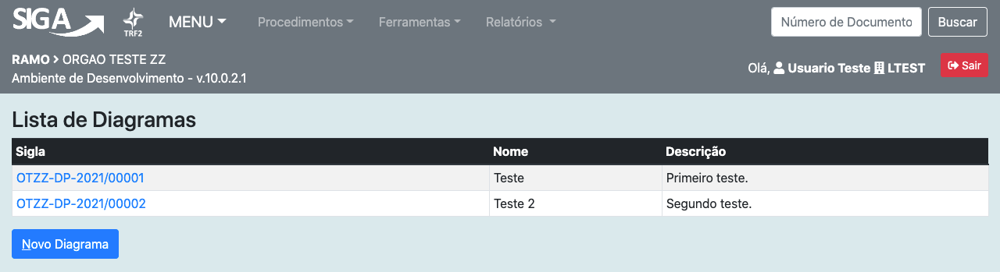
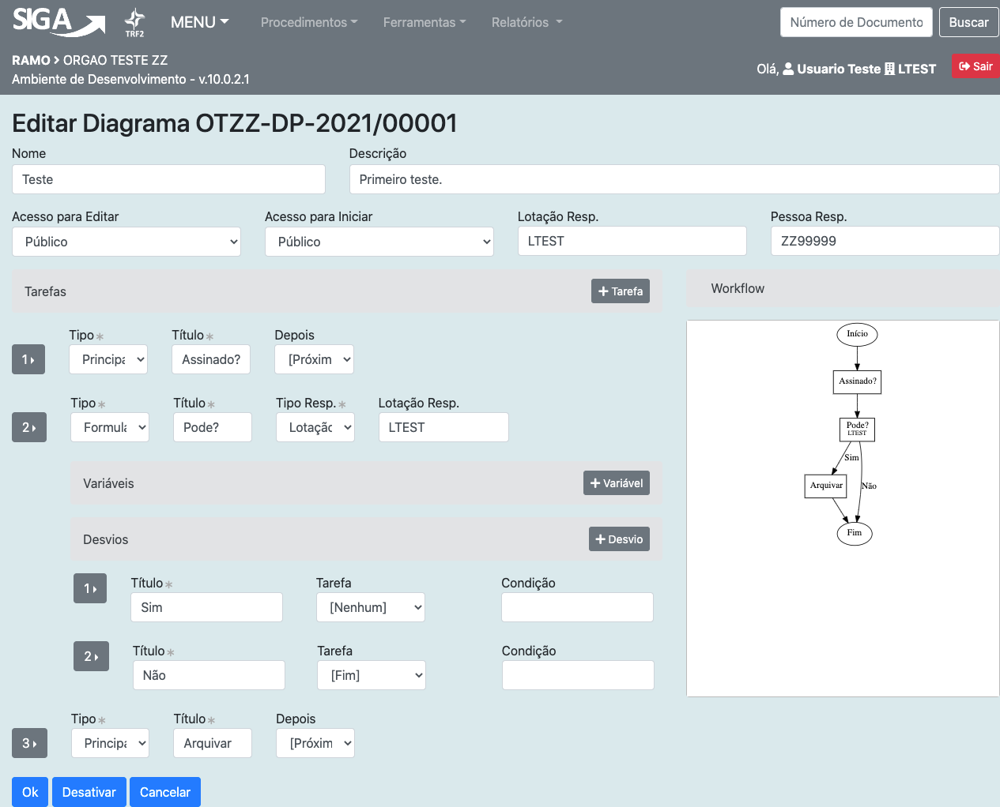
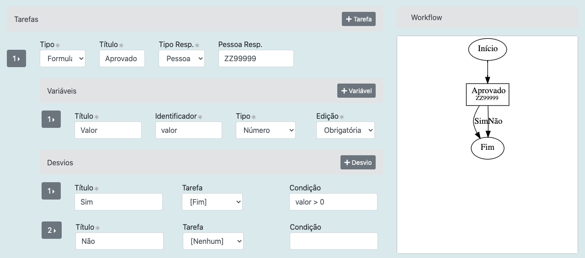
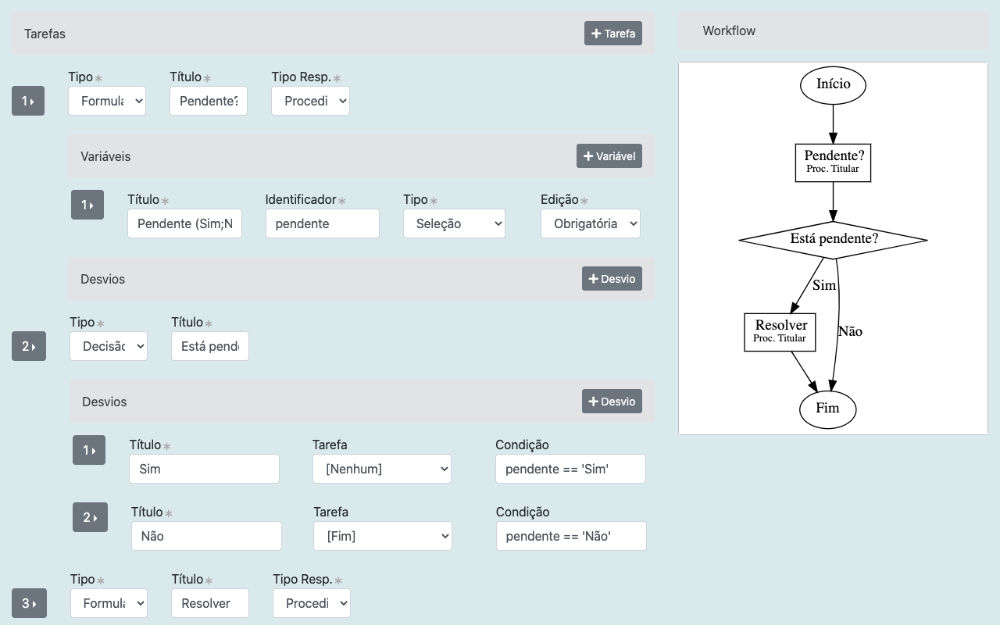
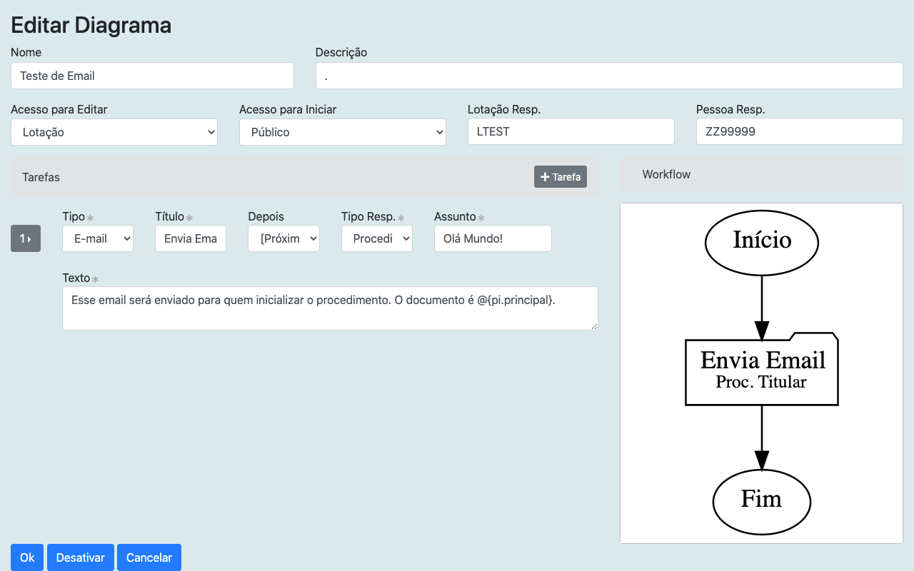
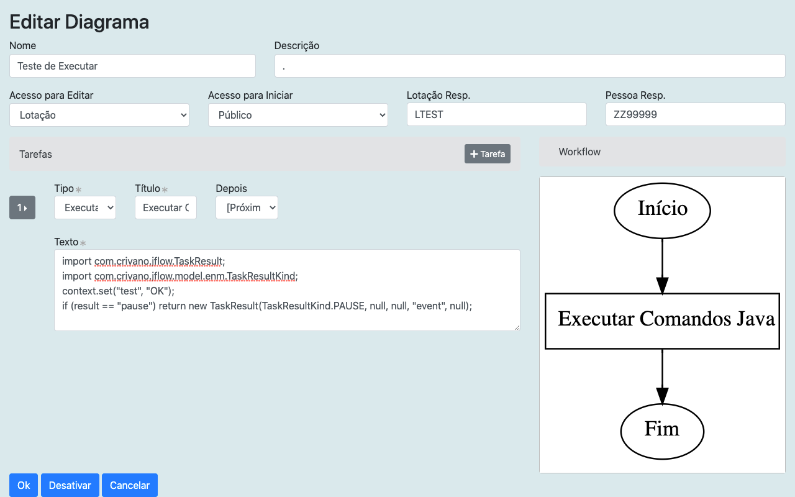
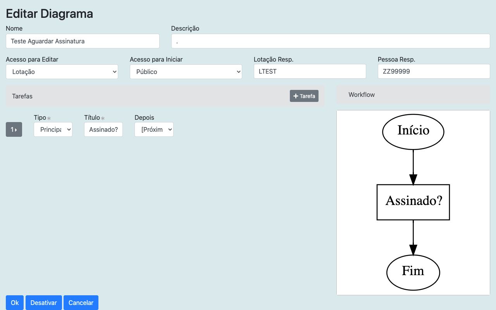
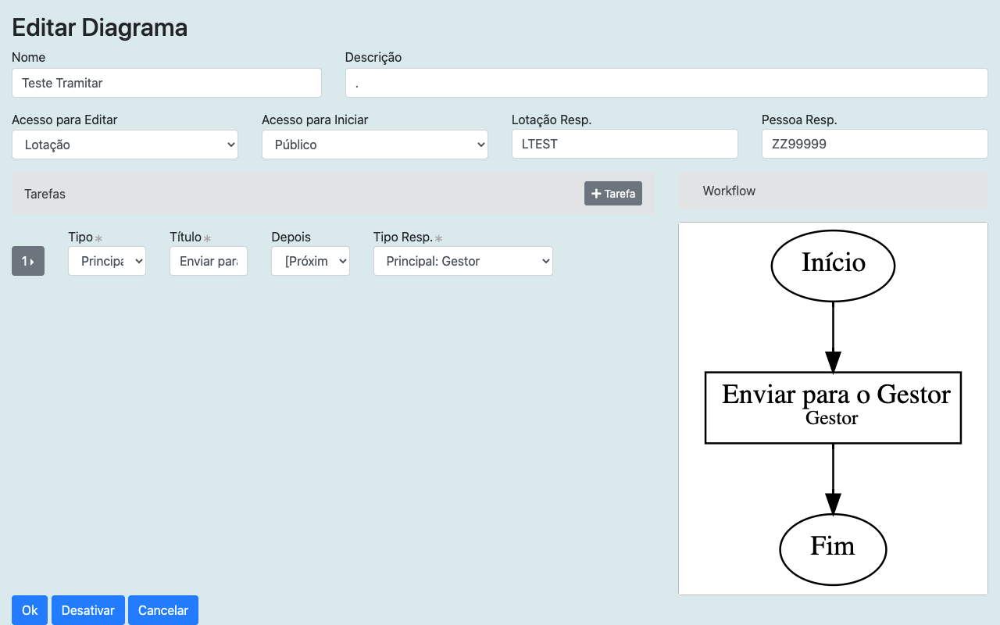
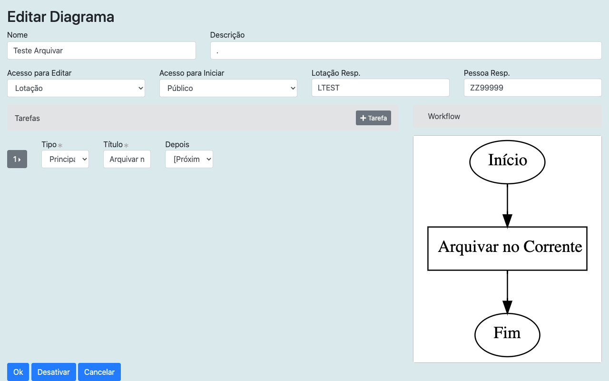
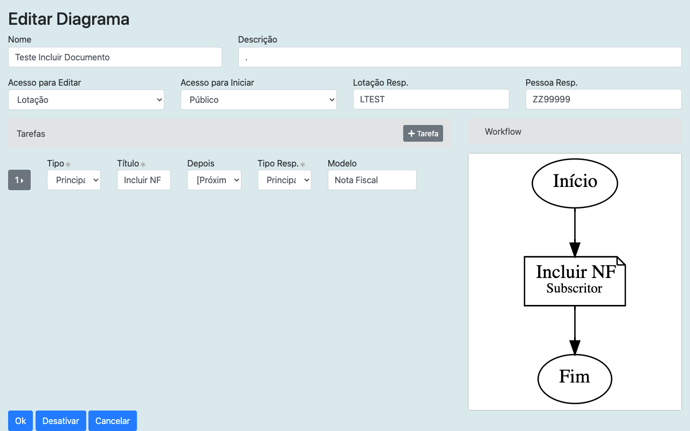

Cadastro de Diagramas
=====================

Um usuário com as devidas permissões pode acessar a página de cadastro de diagramas. Para isso, o usuário escolherá, no menu do módulo de workflow, a opção Ferramentas > Cadastro de Diagramas.

A página inicial permite a pesquisa em diagramas previamente cadastrados e possui links para editar ou remover um diagrama, além de um botão para criar um novo diagrama.

A página de edição/criação de diagrama possui diversos campos que devem ser preenchidos de modo a especificar qual é nome e a descrição do diagrama, quem tem acesso para editá-lo e iniciá-lo, e qual é a lotação e a pessoa que são responsáveis por este diagrama.

Para definir as tarefas que compõem um diagrama, o usuário deve clicar em "+ Tarefa" e prencher os campos que serão apresentados.

Primeiro ele escolherá o tipo da tarefa, numa lista que será detalhada mais a frente. 
Também deve preencher o título que será exibido no diagrama.
Caso haja a necessidade de desviar para uma outra tarefa após a conclusão desta, a próxima tarefa deve ser informada no campo "Depois", se este campo for deixado em branco, após esta tarefa será executada a seguinte na lista. 
Dependendo do tipo serão apresentados outros campos que serão descritos a seguir.

A lista completa de tipos de tarefas, detalhes de como cada uma delas funciona e quais são os campos adicionais podem ser vistos a seguir.

Tipos de Tarefas
================

.. csv-table:: Resumo dos Tipos de Tarefas
   :header: "Tipo de Tarefa", "Descrição", "Forma de avançar"
   :widths: auto

   "Formulário", "Aguarda o usuário realizar uma atividade", "Após o usuário informar prosseguimento"
   "Decisão", "Define a próxima tarefa a ser executada com base em regra pré-definida", "Automática, após aplicação da regra pelo sistema"
   "Email", "Envia um email para o destino previamente informado", "Automática, após envio do email pelo sistema"
   "Executar, ", "Tarefa de uso exclusivo da área de TI, visando a execução de rotinas programadas", "Automática, após execução da rotina pelo sistema"
   "Principal: Aguardar assinatura", "Aguarda a assinatura do documento principal. Utilizada quando o fluxo é iniciado antes do documento vinculado ao mesmo estar assinado e o fluxo não deve avançar antes da assinatura.", "Após o usuário assinar o documento principal"
   "Principal: Tramitar", "Realiza a tramitação automática do documento principal para o destino definido", "Automática, após o registro da tramitação pelo sistema"
   "Principal: Arquivar", "Realiza o arquivamento do documento principal", "Automática, após o registro do arquivamento pelo sistema"
   "Principal: Incluir documento", "Aguardar a inclusão de um documento no documento principal (Juntada)", "Após o usuário juntar o documento"

Formulário
----------

Um formulário indica uma tarefa que deve ser realizada por um usuário, uma tarefa "humana" no jargão do workflow. Essa é a mais complexa das tarefas porque ela envolve três conceitos importantes: responsável, variável e desvio.

Primeiro deve ser selecionado o tipo de responsável de uma lista bem extensa. Por exemplo, podemos selecionar uma "Lotação" ou uma "Pessoa" específica para simplificar, mas existem muitas outras opções. A lista completa está mais a frente.

Basicamente, o usuário pode interagir com o sistema visualizando ou informando o valor de variáveis associadas a esse procedimento, e também pode decidir para onde o fluxo deve seguir escolhendo um desvio.

Para configurar as variáveis com as quais o usuário irá interagir, clique em "+ Variável" e preencha o título da variável, o identificador, o tipo e indique se ela é editável, se é obrigatória ou se é apenas para ser apresentada. O título é a descrição da variável. Já o identificador é o "nome da variável", ele deve ser composto apenas de letras minúsculas, números e *under_score*, sem espaços ou caracteres especiais. Os tipos de variáveis disponíveis são:

1. **Texto**: uma string simples.
2. **Número**: um número fracionário.
3. **Data**: no formato DD/MM/YYYY.
4. **Booleano**: um valor tipo Sim/Não.
5. **Seleção**: uma lista de opções. As opções devem ser informadas no campo título, por exemplo: "Estado Civil (Solteiro;Casado)"
6. **Pessoa**: campo de seleção de pessoa.
7. **Lotação**: seleção de lotação.
8. **Documento**: seleção de documento.

Já os desvios são configuráveis clicando no botão "+ Desvio". Os campos a serem preenchidos são o título, uma seleção que inclui todas as outras tarefas ou "Nenhuma" ou "Fim" e a condição. 
O título será apresentado ao lado da seta que representa o desvio.
A tarefa representa a próxima tarefa que será executada quando o usuário escolher este desvio. A opção "Nenhuma" significa que ao escolher esse desvio o fluxo seguirá para a tarefa seguinte da lista ou para o "Fim" se a tarefa atual for a última.
Por fim, a condição é uma expressão calculada com o `MVel2 <http://mvel.documentnode.com/>`_ a partir das variáveis disponíveis no procedimento. Se ela for deixada em branco, o desvio sempre estará ativo, caso seja preenchida, só estará ativo se o resultado da expressão for o valor lógico "verdadeiro".

Crie quantas variáveis e desvios desejar. Se nenhum desvio for criado, o sistema automaticamente criará um botão para o usuário clicar chamado "Prosseguir". Ele funciona como um desvio para a próxima tarefa da lista. 

O caso mais simples de formulário requer apenas o título da tarefa e a definição do responsável, sem nenhuma variável ou desvio.

Decisão
-------

A decisão é uma tarefa executada automaticamente pelo sistema, sem a intervenção do usuário. Chamaremos tarefas desse tipo de tarefas automáticas.

Da mesma forma que o usuário seleciona um desvio no caso do formulário, o sistema seleciona um desvio no caso da decisão. 
Para cada desvio possível deve existir uma condição, que é uma fórmula, baseada nas variáveis do procedimento, que indica se o desvio está ativo ou não.
A decisão prosseguirá pelo primeiro desvio que apresentar uma condição ativa.

E-mail
------

E-mail é uma tarefa automática que dispara um email para o responsável ou para todos os membros de sua lotação.

Além de escolher o destinatário do email, utilizando o campo "Tipo Resp.", podem ser informados o "Assunto" e o "Texto" do email.

Variáveis disponíveis no procedimento ou até mesmo outras informações do contexto pode ser inseridas no corpo do email ou no assunto utilizando a sintaxe de processamento de templates do MVEL2. Por exemplo, o código do documento vinculado ao procedimento pode ser especificado assim: @{pi.principal}.

Executar
--------

Tarefa automática que serve para executar um programa escrito na linguagem de programação MVEL2, que é muito próxima ao Java.
Este tipo de tarefa só deve ser utilizado por programadores que conheçam bem o sistema e saibam exatamente o que estão fazendo.

Principal: Aguardar Assinatura
------------------------------

Pausa a execução do procedimento até que o documento principal esteja assinado. 
Não existe nenhum parâmetro adicional a ser configurado para esse tipo de tarefa.

Principal: Tramitar
-------------------

Tramita o documento principal para o responsável indicado pelo parâmetro "Tipo Resp.". De maneira geral, não é necessário utilizar este tipo de tarefa pois o trâmite já é realizado automaticamente para os reponsáveis pelas tarefas do tipo formulário. No entanto, antes do término de um procedimento, pode ser interessante tramitar o documento para a pessoa que deve fazer a guarda.

Principal: Arquivar
-------------------

Arquiva o documento principal no arquivo corrente. Não é necessário informar nenhum outro parâmetro.

Principal: Incluir Documento
------------------------------

Este é um tipo de tarefa que provoca uma pausa na execução do procedimento até que determinado modelo de documento seja juntado ao principal.

Configure a tarefa informando o responsável peja juntada e também o modelo do documento.

Tipos de Destinatários
======================

+------------------------------------+-----------------------------------+
| Tipo de responsável                | Descrição                         |
+------------------------------------+-----------------------------------+
| Pessoa                             | Para quando a tarefa deve ser     |
|                                    | executada por uma pessoa          |
|                                    | pré-determinada (pessoa fixa)     |
+------------------------------------+-----------------------------------+
| Lotação                            | Para quando a tarefa deve ser     |
|                                    | executada por uma lotação         |
|                                    | pré-determinada (lotação fixa)    |
+------------------------------------+-----------------------------------+
| Tabelado                           |                                   |
+------------------------------------+-----------------------------------+
| Procedimento: Titular              | Quando a tarefa deve ser          |
|                                    | executada pela pessoa que iniciou |
|                                    | o fluxo                           |
+------------------------------------+-----------------------------------+
| Procedimento: Lotação do Titular   | Quando a tarefa deve ser          |
|                                    | executada pela lotação da pessoa  |
|                                    | que iniciou o fluxo.              |
+------------------------------------+-----------------------------------+
| Principal: Cadastrante,            | Define o responsável a partir das |
| Principal: Lotação do Cadastrante, | informações e perfis que constam  |
| Principal: Titular,                | do documento principal vinculado  |
| Principal: Lotação do Titular,     | ao fluxo                          |
| Principal: Subscritor,             |                                   |
| Principal: Lotação do Subscritor,  |                                   |
| Principal: Destinatário,           |                                   |
| Principal: Lotação do              |                                   |
| Destinatário,                      |                                   |
| Principal: Gestor,                 |                                   |
| Principal: Lotação do Gestor,      |                                   |
| Principal: Fiscal Técnico,         |                                   |
| Principal: Lotação do Fiscal       |                                   |
| Técnico,                           |                                   |
| Principal: Fiscal Administrativo,  |                                   |
| Principal: Lotação do Fiscal,      |                                   |
| Administrativo,                    |                                   |
| Principal: Interessado,            |                                   |
| Principal: Lotação do Interessado, |                                   |
| Principal: Interessado,            |                                   |
| Principal: Lotação do Autorizador, |                                   |
| Principal: Interessado,            |                                   |
| Principal: Lotação do Revisor,     |                                   |
| Principal: Interessado,            |                                   |
| Principal: Lotação do Liquidante,  |                                   |
+------------------------------------+-----------------------------------+